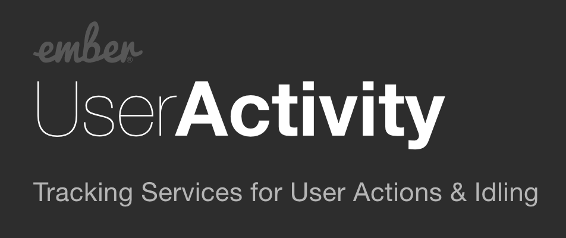

# 

[](https://app.netlify.com/sites/competent-heyrovsky-4758aa/deploys)
[](https://github.com/elwayman02/ember-user-activity/actions?query=workflow%3ACI)
[](https://emberobserver.com/addons/ember-user-activity)
[](https://codeclimate.com/github/elwayman02/ember-user-activity)

This addon provides services for detecting user activity & idling across the entire application.

Check out the [Demo](https://ember-user-activity.jhawk.co/)!

We adhere to the [Ember Community Guidelines](https://emberjs.com/guidelines/) for our Code of Conduct.


## Compatibility

* Ember.js v4.8 or above
* Ember CLI v4.8 or above
* Node.js v18 or above


## Installation

```bash
ember install ember-user-activity
```


## Usage

### User Activity Service

This service fires events from global window listeners.
These listeners trigger on capture, meaning they are not affected by event cancellation.

These `window` events are enabled by default:

* `keydown` - Fires when a key is pressed
* `mousedown` - Fires when a mouse is clicked
* `scroll` - Fires when the user scrolls
* `touchstart` - Fires when a touch point is placed on the touch surface [Mobile-Friendly]
* `storage` - Fires when any activity event is triggered on another tab of the same website. This avoids problems when a user opens up serveral tabs to the same application.
* ~~`mousemove` - Fires when the user moves the mouse~~ [Removed as of v0.2.0](https://github.com/elwayman02/ember-user-activity/issues/16)

A custom event, `userActive` is fired for ALL enabled events.

To catch these events, simply inject the service and subscribe to the events you care about:

```javascript
import Component from '@glimmer/component';
import { service } from '@ember/service';

// any file where services can be injected
export default class MyComponent extends Component {
  @service userActivity;

  setupListeners() {
    this.userActivity.on('userActive', this, this.activeHandler);
  }

  activeHandler(event) {
    // do stuff
  }
}
```

Each event handler will receive the standard DOM `event` object
(ex: [mousemove](https://developer.mozilla.org/en-US/docs/Web/Events/mousemove)).

Unsubscribe from any event by calling `off`:

```javascript
this.userActivity.off('userActive', this, this.activeHandler);
```

Note: While our event dispatch system mirrors Ember.Evented, it does not include the `one` method. 
Only `on`, `off`, and `trigger` have been implemented. If you feel `one` is necessary for you, 
we're happy to accept PRs!

#### Event Configuration

If you would like to listen to a different set of events, extend the service in your app:

```javascript
// app/services/user-activity.js
import UserActivityService from 'ember-user-activity/services/user-activity';

export default class UserActivity extends UserActivityService {
  defaultEvents = ['keypress', 'mouseenter', 'mousemove'];
}
```

Additionally, you can enable/disable events after the service has been initialized.

```javascript
this.userActivity.enableEvent('keyup');
this.userActivity.disableEvent('mousedown');
```

Event names must be from the [DOM Event](https://developer.mozilla.org/en-US/docs/Web/Events) list.
Custom events are not currently supported. If you enable an event name
that was not set up by default, a new listener will be created automatically.

You can find out if an event is currently enabled:

```javascript
this.userActivity.isEnabled('foo'); // false
this.userActivity.isEnabled('keydown'); // true
```

#### Performance Configuration

Each individual event is throttled by 100ms for performance reasons,
to avoid clogging apps with a firehose of activity events. The length of
the throttling can be configured by setting `EVENT_THROTTLE` on the activity service.

```javascript
// app/services/user-activity.js
import UserActivityService from 'ember-user-activity/services/user-activity';

export default class UserActivity extends UserActivityService {
  EVENT_THROTTLE = 200; // 200 ms
}

```

Setting `EVENT_THROTTLE` to 0 will enable the full firehose of events.
This may cause performance issues in your application if non-trivial
amounts of code are being executed for each event being fired.

### User Idle Service

This service tracks user activity to decide when a user has gone idle by
not interacting with the page for a set amount of time.

```javascript
import Component from '@glimmer/component';
import { service } from '@ember/service';
import { readOnly } from '@ember/object/computed'

export default class MyComponent extends Component {
  @service userIdle;

  @readOnly('userIdle.isIdle')
  isIdle;
}
```

The default timeout is set for 10 minutes but can be overridden by extending the service:

```javascript
// app/services/user-idle.js
import UserIdleService from 'ember-user-activity/services/user-idle';

export default class UserIdle extends UserIdleService {
  IDLE_TIMEOUT = 300000 // 5 minutes
}
```

By default, the idle service listens to the `userActive` event, but it can be
configured to listen to a custom set of events from the `user-activity` service:

```javascript
// app/services/user-idle.js
import UserIdleService from 'ember-user-activity/services/user-idle';

export default class UserIdle extends UserIdleService {
  activeEvents = ['mousedown', 'keydown'];
}
```

Note that the `userActive` event is a superset of all events fired from `user-activity`,
so in most cases you won't need to change this.

The idle service has a `idleChanged` event when `isIdle` gets changed.

```javascript
import Component from '@glimmer/component';
import { service } from '@ember/service';

export default class MyComponent extends Component {
  @service userIdle;

  constructor() {
    this.userIdle.on('idleChanged', (isIdle) => {
      // isIdle is true if idle. False otherwise.
    });
  }
}
```

### Scroll Activity Service

This service tracks scrolling within the application by periodically checking
(via [requestAnimationFrame](https://developer.mozilla.org/en-US/docs/Web/API/window/requestAnimationFrame))
for changes in scroll position for the various scrollable elements in the page. By default, it only
checks `document`, but the [Scroll Activity Mixin](#scroll-activity-mixin) provides an easy
way to register your components as well. The [User Activity Service](#user-activity-service) subscribes to these scrolling events by default, so you do not need to do anything to use this service for global scroll events if you are already injecting the user-activity service.

Any elements can be subscribed to this service:

```javascript
this.scrollActivity.subscribe(this, element);
```

`subscribe` requires at least two parameters:

* `target` - Usually `this`, target just needs to be a unique identifier/object
that can be used to unsubscribe from the service
* `element` - The scrollable element (can be a DOM or jQuery element - jQuery not required!)

Two optional parameters may follow:

* `callback` - A callback to execute when scrolling has been detected in the element
* `highPriority` - A boolean (default `true`) specifying this subscriber should eagerly check
  scroll positions on each animation frame. When `false`, it will instead
  use an approximation of idle checking on the UI thread to avoid performing
  measurements at sensitive times for other work (like rendering).

Conversely, elements can also be unsubscribed:

```javascript
this.scrollActivity.unsubscribe(this);
```

`unsubscribe` only requires the `target` parameter that was initially used to `subscribe`.

### Cleanup

Please remember that subscribing to events can cause memory leaks if they are not properly cleaned up.
Make sure to remove any listeners before destroying their parent objects.

```javascript
// app/components/foo-bar.js
export default class FooBar extends Component {
  willDestroy() {
    this.userActivity.off('keydown', this, this.keydownHandler);
  }
}
```

### Using in an Addon

Building your own addon to extend Ember User Activity? No problem!

```javascript
// my-addon/addon/services/user-idle.js
import UserIdleService from 'ember-user-activity/services/user-idle';

export default class UserIdle extends UserIdleService {
  IDLE_TIMEOUT = 3000; // 3 minutes
}
```


## Contributing

See the [Contributing](CONTRIBUTING.md) guide for details.


## License

This project is licensed under the [MIT License](LICENSE.md).
